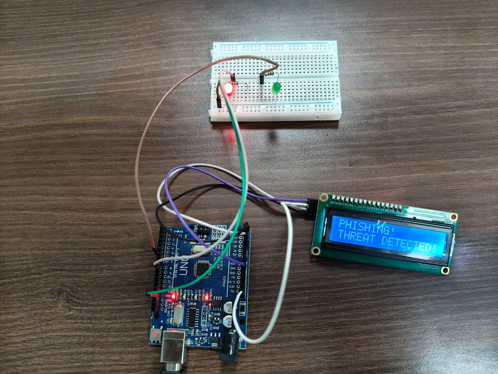

# 🛡️ PhishGuard — Real-Time Phishing Detection & Reporting System

> **From threat detection to legal complaint in under 60 seconds.**

  

---

## 📸 Hardware Demo

<p align="center">
  
  <br/>
  <em>Live demo: Arduino Uno + 16×2 LCD + Red/Green LEDs triggering a physical phishing alert in real time</em>
</p>

---

## 🚨 The Problem

Phishing attacks via **email, SMS, and WhatsApp** are surging across India — and victims have no real-time tool to trace, analyze, or report them.

| Gap | Impact |
|-----|--------|
| Existing platforms can't parse raw email headers | Attack origins remain **untraceable** |
| No geolocation of sender IPs on India map | **No visual evidence** for reporting |
| Purely digital alerts are easy to miss | Victims get **no physical warning** |
| Reporting to cybercrime portal is manual & slow | Reporting takes **hours**, not minutes |

---

## ✅ Our Solution

PhishGuard is an **end-to-end phishing response system** that takes a user from threat detection to legal reporting in under a minute.

```
📧 Suspicious Message
        ↓
🔍 AI-Powered Analysis (parse headers, extract IPs)
        ↓
🗺️  Geolocation → Plotted on India Map
        ↓
🚨 Physical Alert (Arduino flashes RED + buzzer)
        ↓
📝 Auto-Generated Police Complaint
        ↓
🌐 One-Click → cybercrime.gov.in (pre-filled)
```

---

## ⚙️ Features

### 🔬 Threat Analysis
- Parses raw email headers to extract **sender IP addresses**
- Identifies phishing patterns across Email, SMS, and WhatsApp messages
- Uses AI to classify threats and estimate attack origin

### 🗺️ IP Geolocation & Mapping
- Geolocates the sender's server in real time
- Plots the origin on an **interactive India map** — visual evidence you can attach to your complaint

### 🔴 Physical Hardware Alert (Arduino)
- The moment a threat is detected, the system sends a serial signal to an **Arduino Uno**
- **Red LED flashes** + buzzer sounds + **16×2 LCD displays `PHISHING! THREAT DETECTED!`**
- No way to miss it — even if your screen is minimized

### 📝 One-Click Police Complaint
- Hit **"Generate Police Complaint"** and the AI writes a ready-to-submit FIR draft — complete with IP, timestamp, message content, and threat classification
- A single click opens [cybercrime.gov.in](https://cybercrime.gov.in) with the complaint pre-filled
- Reduces reporting time from **hours → seconds**

---

## 🧰 Tech Stack

| Layer | Technology |
|-------|-----------|
| Backend | Python (Flask) |
| AI Analysis | Claude API / OpenAI |
| IP Geolocation | ip-api.com / MaxMind |
| Map Visualization | Folium + Leaflet.js |
| Hardware | Arduino Uno, 16×2 LCD (I2C), LEDs, Buzzer |
| Serial Communication | PySerial |
| Frontend | HTML/CSS/JS |

---

## 🔌 Hardware Setup

**Components:**
- Arduino Uno
- 16×2 LCD Display (I2C)
- Red LED + Green LED
- Buzzer
- Breadboard + jumper wires

**Wiring:**

| Component | Arduino Pin |
|-----------|------------|
| LCD SDA | A4 |
| LCD SCL | A5 |
| Red LED | D8 |
| Green LED | D9 |
| Buzzer | D10 |

Upload `arduino/phishguard.ino` to your board before running the Python backend.

---

## 🚀 Getting Started

### 1. Clone the repo
```bash
git clone https://github.com/yourusername/phishguard.git
cd phishguard
```

### 2. Install dependencies
```bash
pip install -r requirements.txt
```

### 3. Configure
```bash
cp .env.example .env
# Add your API keys: ANTHROPIC_API_KEY, IPAPI_KEY
```

### 4. Flash the Arduino
Open `arduino/phishguard.ino` in the Arduino IDE and upload to your board.

### 5. Run the app
```bash
python app.py
```
Visit `http://localhost:5000` in your browser.

---

## 📁 Project Structure

```
phishguard/
├── app.py                  # Flask backend
├── analyzer/
│   ├── header_parser.py    # Email header extraction
│   ├── ip_geolocate.py     # IP → lat/lng lookup
│   └── ai_classifier.py    # AI threat classification
├── arduino/
│   └── phishguard.ino      # Arduino sketch
├── static/
│   └── map/                # India map output (Folium)
├── templates/
│   └── index.html          # Frontend UI
├── assets/
│   └── demo.jpeg           # Hardware demo photo
└── requirements.txt
```

---

## 🇮🇳 Why This Matters

India reported over **1.1 million cybercrime complaints** in 2023 alone. Most victims never file a report — not because they don't want to, but because the process is overwhelming. PhishGuard collapses the entire response pipeline into a single interface, making it accessible to anyone, regardless of technical background.

---

## 🤝 Contributing

Pull requests are welcome. For major changes, please open an issue first to discuss what you'd like to change.

---

## 📄 License

MIT License — see [LICENSE](LICENSE) for details.

---

<p align="center">Built with ❤️ to make India's internet safer.</p>
